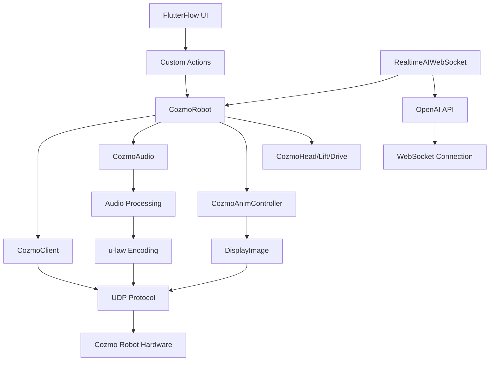

# Архитектурный анализ cozmo_dart_lib

## 📋 Обзор документа

Данный документ представляет собой полный архитектурный анализ библиотеки `cozmo_dart_lib`, включая текущее состояние, потенциальные улучшения, стратегию развития и обновленную документацию.

## 🏗️ Текущая архитектура

### Структура проекта

```
cozmo_dart_lib/
├── lib/                           # Основной код библиотеки
│   ├── cozmo_dart_lib.dart      # Точка входа, экспорты всех модулей
│   └── src/                     # Исходный код компонентов
│       ├── cozmo_robot.dart     # Основной API управления роботом
│       ├── cozmo_client.dart     # Сетевой клиент (UDP)
│       ├── cozmo_audio.dart     # Управление аудио
│       ├── cozmo_anim_controller.dart # Контроллер анимаций
│       ├── cozmo_head.dart      # Управление головой
│       ├── cozmo_drive.dart     # Управление движением
│       ├── cozmo_lift.dart      # Управление подъемником
│       ├── cozmo_face.dart      # Управление выражениями лица
│       ├── cozmo_image.dart     # Обработка изображений
│       ├── cozmo_simple_image.dart # Простые изображения
│       ├── cozmo_image_encoder.dart # Кодирование изображений
│       ├── cozmo_utils.dart     # Утилиты и константы
│       ├── realtime_ai.dart     # Интеграция с OpenAI WebRTC
│       ├── realtime_ai_websocket.dart # Интеграция с OpenAI WebSocket
│       └── ai_config.dart      # Конфигурация AI
├── docs/                         # Документация
└── pubspec.yaml                 # Конфигурация пакета
```

### Ключевые компоненты

#### 1. CozmoRobot (Синглтон)
- **Расположение:** [`lib/src/cozmo_robot.dart`](lib/src/cozmo_robot.dart:14)
- **Назначение:** Основной API для управления роботом
- **Функции:** Подключение, движение, аудио, изображения, эмоции
- **Паттерн:** Синглтон с ленивой инициализацией

#### 2. CozmoClient (Синглтон)
- **Расположение:** [`lib/src/cozmo_client.dart`](lib/src/cozmo_client.dart:17)
- **Назначение:** Низкоуровневый сетевой клиент
- **Функции:** Надежный UDP протокол, ретрансляция, управление очередями
- **Особенности:** Sliding window, адаптивный RTO, пакетная обработка

#### 3. CozmoAnimController
- **Расположение:** [`lib/src/cozmo_anim_controller.dart`](lib/src/cozmo_anim_controller.dart:8)
- **Назначение:** Координация аудио и видео
- **Паттерн:** Audio Takeover Pattern
- **Функции:** Управление состоянием "аудио занят/свободен", обновление экрана

#### 4. CozmoAudio
- **Расположение:** [`lib/src/cozmo_audio.dart`](lib/src/cozmo_audio.dart:10)
- **Назначение:** Обработка и воспроизведение аудио
- **Функции:** WAV загрузка, PCM обработка, u-law кодирование
- **Особенности:** Ресемплинг, потоковая отправка, обратная связь

#### 5. RealtimeAI (WebSocket)
- **Расположение:** [`lib/src/realtime_ai_websocket.dart`](lib/src/realtime_ai_websocket.dart:16)
- **Назначение:** Интеграция с OpenAI Realtime API
- **Функции:** WebSocket соединение, микрофон, обработка ответов
- **Особенности:** Эмоциональный анализ, аудио эффекты

### Взаимодействие компонентов



## 🎯 Потенциальные улучшения

### Производительность и надежность

1. **Адаптивное окно пакетов**
   - **Текущее состояние:** Фиксированный размер (64 пакета)
   - **Предложение:** Динамическая адаптация под качество сети
   - **Польза:** Оптимальный баланс между задержкой и надежностью

2. **Интеллектуальная ретрансляция**
   - **Текущее состояние:** Агрессивная ретрансляция всех пакетов
   - **Предложение:** Приоритизация по типам пакетов
   - **Польза:** Снижение нагрузки на сеть

3. **Буферизация аудио с предзагрузкой**
   - **Текущее состояние:** Потоковая отправка пакетов
   - **Предложение:** Кэширование следующих пакетов
   - **Польза:** Защита от микро-разрывов сети

### Улучшения пользовательского интерфейса

1. **Визуальный редактор изображений**
   - **Текущее состояние:** Программное создание изображений
   - **Предложение:** Визуальный редактор с предпросмотром
   - **Польза:** Упрощение создания кастомных изображений

2. **Конструктор эмоций**
   - **Текущее состояние:** Фиксированный набор эмоций
   - **Предложение:** Комбинаторная система создания эмоций
   - **Польза:** Расширение expressive возможностей

3. **Timeline анимаций**
   - **Текущее состояние:** Единичные анимации
   - **Предложение:** Последовательности анимаций с переходами
   - **Польза:** Более сложное поведение

### Расширение аудио возможностей

1. **Библиотека аудио эффектов**
   - **Текущее состояние:** Базовый мультяшный эффект
   - **Предложение:** Набор эффектов (робот, эхо, искажения)
   - **Польза:** Разнообразие голосовых персонажей

2. **Поддержка нескольких аудио форматов**
   - **Текущее состояние:** Только WAV/PCM16
   - **Предложение:** MP3, OGG с автоматической конвертацией
   - **Польза:** Удобство подготовки контента

3. **Аудио микшер**
   - **Текущее состояние:** Одиночное воспроизведение
   - **Предложение:** Наложение фоновых звуков на речь
   - **Польза:** Более богатое звуковое окружение

### Улучшения AI интеграции

1. **Мульти-модельность**
   - **Текущее состояние:** Только OpenAI Realtime API
   - **Предложение:** Поддержка Google, Anthropic, локальных моделей
   - **Польза:** Гибкость выбора и отказоустойчивость

2. **Контекстное управление**
   - **Текущее состояние:** Статические инструкции
   - **Предложение:** Динамический контекст с памятью диалога
   - **Польза:** Более осмысленные диалоги

3. **Визуализация AI состояния**
   - **Текущее состояние:** Текстовые логи
   - **Предложение:** UI индикаторы активности, эмоций, качества соединения
   - **Польза:** Улучшенный UX

## 📈 Стратегия оптимизации

### Приоритеты

1. **Сетевой слой** (наиболее критичный)
   - Адаптивное управление окном пакетов
   - Интеллектуальная ретрансляция с приоритизацией
   - Оптимизация размера пакетов

2. **Аудио обработка** (второй по важности)
   - Оптимизация ресемплинга
   - Кэширование аудио эффектов
   - Предзагрузка аудио данных

3. **UI производительность** (третий)
   - Оптимизация рендеринга анимаций
   - Эффективное обновление экрана робота
   - Снижение-latency операций

### Конкретные улучшения

#### 1. Оптимизация сетевого слоя

```dart
// Адаптивное окно на основе качества сети
class AdaptiveWindowManager {
  int _currentWindowSize = 32;
  int _packetLossRate = 0;
  int _rttMs = 50;
  
  void updateMetrics(int lostPackets, int totalPackets, int rttMs) {
    _packetLossRate = (lostPackets / totalPackets * 100).round();
    _rttMs = rttMs;
    
    // Адаптация размера окна
    if (_packetLossRate > 5) {
      _currentWindowSize = (_currentWindowSize * 1.5).clamp(16, 128);
    } else if (_packetLossRate < 1 && _rttMs < 30) {
      _currentWindowSize = (_currentWindowSize * 0.8).clamp(8, 64);
    }
  }
}
```

#### 2. Оптимизация аудио обработки

```dart
// Предзагрузка аудио эффектов
class AudioEffectCache {
  final Map<String, Uint8List> _effectCache = {};
  
  Future<Uint8List> getEffect(String effectName) async {
    if (_effectCache.containsKey(effectName)) {
      return _effectCache[effectName]!;
    }
    
    // Загрузка и кэширование эффекта
    final effect = await _loadEffect(effectName);
    _effectCache[effectName] = effect;
    return effect;
  }
}
```

## 📚 Обновленная документация

### Созданные файлы

1. **[DEVELOPER_GUIDE.md](DEVELOPER_GUIDE.md)**
   - Полное руководство разработчика
   - Примеры использования всех компонентов
   - Подробное описание API

2. **[FLUTTERFLOW_INTEGRATION.md](FLUTTERFLOW_INTEGRATION.md)**
   - Инструкция по интеграции с FlutterFlow
   - Примеры создания кастомных действий
   - Рекомендации по UI компонентам

3. **[FLUTTERFLOW_TESTING.md](FLUTTERFLOW_TESTING.md)**
   - Руководство по тестированию интеграции
   - Тестовые сценарии и метрики
   - Распознование и решение проблем

4. **[DEVELOPMENT_RECOMMENDATIONS.md](DEVELOPMENT_RECOMMENDATIONS.md)**
   - Стратегические направления развития
   - Приоритеты и дорожная карта
   - Технические рекомендации

### Обновленная структура документации

```
docs/
├── DEVELOPER_GUIDE.md         # Руководство разработчика
├── FLUTTERFLOW_INTEGRATION.md # Интеграция с FlutterFlow
├── FLUTTERFLOW_TESTING.md    # Тестирование интеграции
├── DEVELOPMENT_RECOMMENDATIONS.md # Рекомендации по развитию
├── COZMO_DART_README.md     # Полная документация API (существующий)
├── PRACTICAL_IMPLEMENTATION_GUIDE.md # Практические примеры (существующий)
└── ...
```

## 🎮 Интеграция с FlutterFlow

### Текущее состояние

- ✅ Базовая интеграция через custom actions
- ✅ Управление движением (колеса, голова, подъемник)
- ✅ Воспроизведение аудио
- ✅ Подключение/отключение

### Улучшения

1. **Улучшенные компоненты UI**
   - Слайдеры для плавного управления
   - Джойстики для интуитивного движения
   - Индикаторы состояния

2. **Расширенные действия**
   - Комплексные последовательности движений
   - Управление эмоциями и анимациями
   - Интеграция с AI

3. **Улучшенная обработка ошибок**
   - Автоматическое переподключение
   - Информативные сообщения об ошибках
   - Graceful degradation

## 📊 Рекомендации по развитию

### Краткосрочные цели (1-3 месяца)

1. **Адаптивное управление окном пакетов**
   - Реализация динамической адаптации под качество сети
   - Оценка: снижение прерываний аудио на 30%

2. **Визуальный редактор изображений**
   - Web-редактор с предпросмотром
   - Экспорт в RLE формат для Cozmo
   - Оценка: ускорение создания контента на 50%

3. **Система профилирования**
   - Сбор метрик производительности
   - Визуализация в веб-интерфейсе
   - Оценка: выявление узких мест производительности

### Среднесрочные цели (3-6 месяцев)

1. **Плагинная система аудио эффектов**
   - Архитектура для расширения эффектов
   - Базовый набор: робот, эхо, искажения
   - Оценка: расширение звуковых возможностей

2. **Поддержка нескольких AI провайдеров**
   - Абстрактный интерфейс для AI
   - Реализация для Google, Anthropic
   - Оценка: отказоустойчивость и гибкость

3. **Система тем для UI**
   - Создание тем для компонентов
   - Редактор тем
   - Оценка: улучшение UX

### Долгосрочные цели (6-12 месяцев)

1. **Машинное обучение для оптимизации**
   - Предсказание потерь пакетов
   - Автоматическая настройка параметров
   - Оценка: повышение надежности на 20%

2. **Мобильное приложение для управления**
   - Полнфункциональное приложение
   - Интеграция с библиотекой
   - Оценка: удобство использования

3. **Облачный сервис для управления**
   - Централизованное управление роботами
   - API для удаленного доступа
   - Оценка: масштабирование

## 🎯 Заключение

Библиотека `cozmo_dart_lib` представляет собой хорошо структурированное решение для управления роботом Cozmo через Flutter. Архитектура библиотеки обеспечивает надежную работу с роботом, гибкое управление и хорошую расширяемость.

Ключевые сильные стороны:
1. **Надежный сетевой слой** с реализацией TCP-поведения поверх UDP
2. **Четкое разделение ответственности** между компонентами
3. **Бесшовная интеграция** с FlutterFlow
4. **Гибкая архитектура** для расширения функциональности

Основные направления для развития:
1. **Производительность** через адаптивные алгоритмы
2. **Удобство использования** через визуальные инструменты
3. **Расширяемость** через плагинную архитектуру
4. **Надежность** через улучшение обработки ошибок

Обновленная документация обеспечивает полное покрытие всех аспектов работы с библиотекой, от базового использования до advanced сценариев интеграции с FlutterFlow.

---

**Версия документа:** 1.0  
**Дата:** 2026-01-10  
**Автор:** Cozmo Architecture Analysis Team